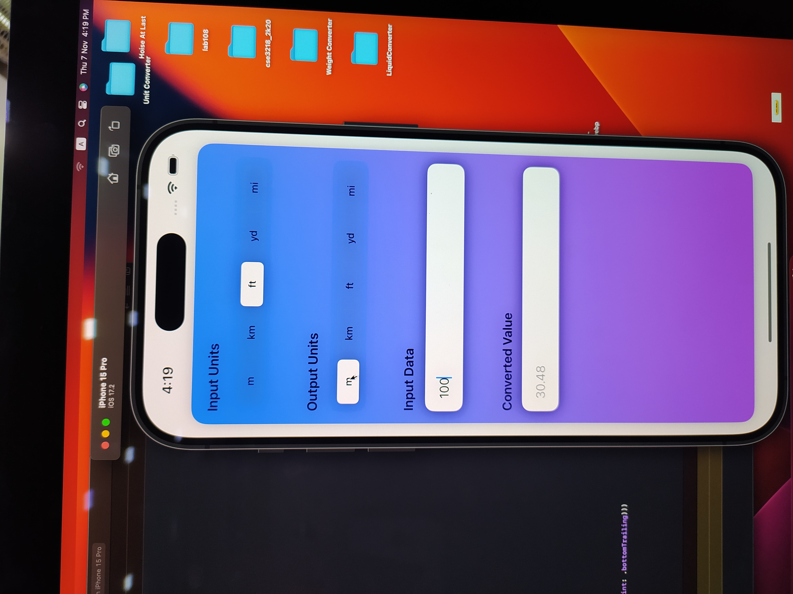

# Unit Converter

This is a simple unit converter tool built with SwiftUI.

## Features

- **Select Input and Output Units**: Choose from various units like meters, kilometers, feet, yards, and miles.
- **Input Data**: Enter the value you want to convert.
- **Real-time Conversion**: The app calculates the converted value instantly.
- **User-Friendly Interface**: A clean and minimal design for easy unit conversions.

## Screenshot




## Video
## Please click on the Image to see complete video

[](https://www.youtube.com/watch?v=0SRo7GG3vZs)

## Technologies Used

- SwiftUI
- Swift
- Xcode

## Getting Started

1. **Clone the repository**:
   ```bash
   git clone https://github.com/Riyadh08/unit-converter.git
